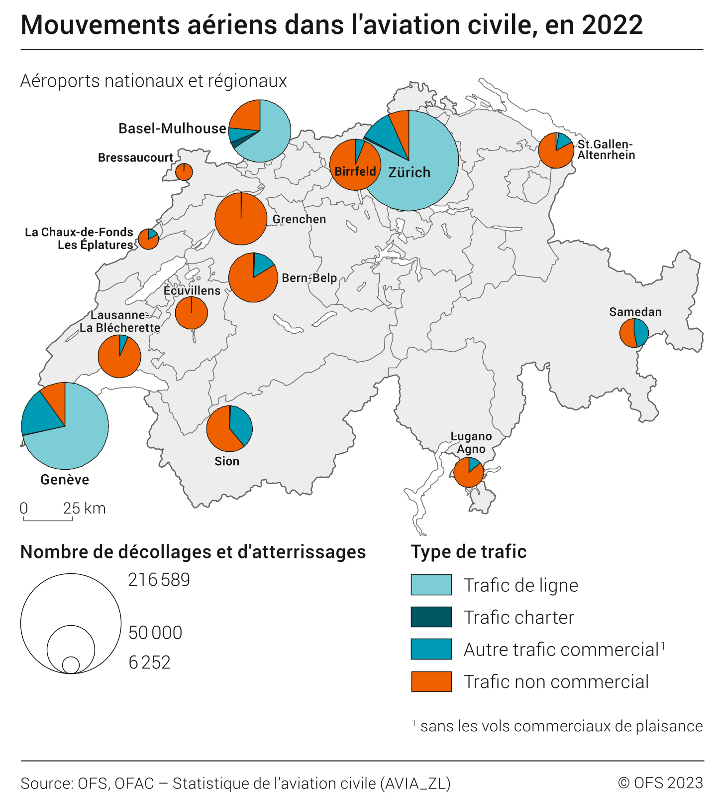

# Et encore...

Évidemment, il y a encore d'autres types de cartes. Il suffit de penser à toutes les cartes touristiques, les plans de ville, les plans des réseaux de transport, les cartes des domaines skiables, les cartes nautiques, etc. On ne peut évidemment pas couvrir tous les types de cartes. Par contre, les principes de base et les règles de visualisation restent toujours les mêmes. Ce sont ces règles que nous allons regarder plus en détail dans la suite du cours.

En effet, toutes les règles de visualisation, notamment l'association entre les types de données et leur représentation possible dans une carte (ou d'ailleurs dans un graphique eaussi) sont définies dans la **sémiologie graphique**.

Même si les règles sont relativement simples, on trouvera régulièrement des cartes qui ne sont pas optimales en terme de visualisation. On verra plus tard comment on arrive à définir une visualisation optimale. 

Un exemple d'une carte peu optimale est la carte suivante:

  
<small>Source: [Office fédéral de statistique](https://www.bfs.admin.ch/bfs/fr/home/statistiques/statistique-regions/cartes/catalogue-cartes-statiques.assetdetail.27425742.html)

Il s'agit d'une carte avec des camemberts proportionnels. Un diagramme en camembert n'est pas une visualisation très efficace, et le fait d'en avoir plusieurs à tailles variables détériore encore plus la lisibilité.

Dans un tel cas, il est souvent mieux de faire plusieurs cartes, même plus petites, et peut-être arrangées côte à côte.

De manière générale, le conseil le plus précieux qu'on peut obtenir en cartographie est de **faire des cartes simples**. Dès qu'il y a trop d'informations sur une carte, la lisibilité en souffre.
